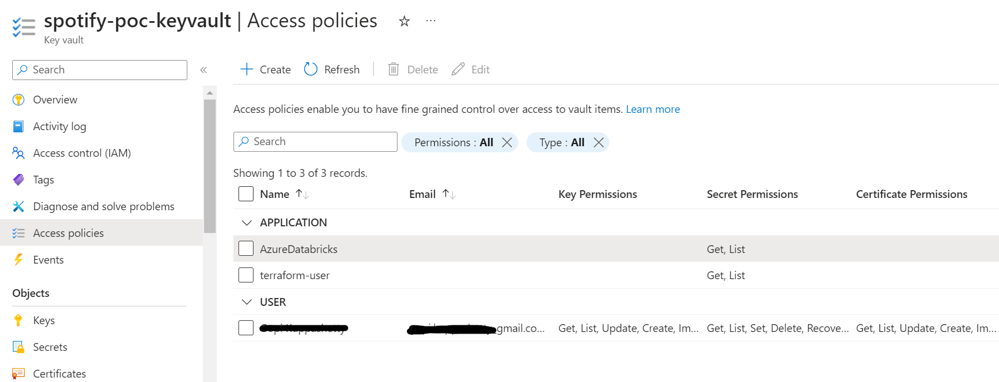

# Azure Configuration for Terraform
This guide outlines the steps to configure your Azure environment for Terraform deployments.

# Create Free Azure Accout
Head over to https://azure.microsoft.com/en-us/free to create your free Azure account. This will grant you access to various free services and a credit balance for additional usage.

# Create App using App registrations
The Microsoft identity platform performs identity and access management (IAM) only for registered applications. Whether it's a client application like a web or mobile app, or it's a web API that backs a client app, registering it establishes a trust relationship between your application and the identity provider, the Microsoft identity platform.

1. Login to the Azure Portal (https://azure.microsoft.com/en-us/get-started/azure-portal)
2. Navigate to Azure Active Directory > App registrations
3. Click New registration
4. Under Name, enter `terraform-user`
5. For Supported account types, choose Accounts in this organizational directory only (Any Azure AD directory - Single tenant)
6. Click Register

[Reference](https://learn.microsoft.com/en-us/entra/identity-platform/quickstart-register-app)

Explanation of App Registration properties:

- Tenant ID: This identifies the Azure Active Directory tenant associated with your subscription.
- Client ID (Application ID): This uniquely identifies your app within the Azure AD tenant.
- Client Secret: This is a secret key used to authenticate your app to Azure services.

<i>**we need this app details for Terraform to access Azure and create resources for us**</i>

# Create Resource Group
A resource group is a container that holds related resources for an Azure solution. The resource group can include all the resources for the solution, or only those resources that you want to manage as a group

1. Navigate to Resource groups in the Azure Portal.
2. Click Create resource group.
3. For Resource group name, enter `SpotifyStreamAnalytics`.
4. Select `East US` from the Region dropdown.
5. Click Create.

[Reference](https://techcommunity.microsoft.com/t5/startups-at-microsoft/step-by-step-guide-creating-an-azure-resource-group-on-azure/ba-p/3792368)

# Resource Group Access Configuration
1. Navigate to `SpotifyStreamAnalytics` Resource group.
2. Click on `Access Contorl (IAM)` again. Select "Role" as `Contributor` and assign it to the app you created before, `terraform-user`.

# Create Key Vault
Azure Key Vault is a cloud service for securely storing and accessing secrets. A secret is anything that you want to tightly control access to, such as API keys, passwords, certificates, or cryptographic keys

1. Navigate to Key Vaults in the Azure Portal.
2. Click Create key vault.
3. Under Resource group, select `SpotifyStreamAnalytics`.
4. For Key vault name, enter `spotify-poc-keyvault`.
5. Select `East US` from the Location dropdown.
6. In Access Configuration section, Select `Vault access Policy` permission model.

6. Click Review + Create.
7. On the review page, verify the settings and click Create.

[Read about creating Keyvault](https://learn.microsoft.com/en-us/azure/key-vault/general/quick-create-portal)  
[Read about vault access policyService Pi](https://learn.microsoft.com/en-us/azure/key-vault/general/assign-access-policy?tabs=azure-portal)  
[Vault Policy vs RBAC](https://learn.microsoft.com/en-us/azure/key-vault/general/rbac-access-policy)

# Access Configuration in Key Vault
1. Navigate to your Key Vault. Go to the "Access policies" section.
2. Click on `Access Contorl (IAM)`. Select "Role" as `Key Vault Administrator` and assign it to yourself.
3. Click on `Access Contorl (IAM)` again. Select "Role" as `Key Vault Reader` and assign it to the app you created before, `terraform-user`.
4. Click on `Access policies` -> `Create`. Select All pemissions and add yourself as `Principal`.
5. Click on `Access policies` -> `Create`. Select `Secrets` -> "Get", "List" permissions. Select `terraform-user` app as the `Principal`.
6. Click on `Access policies` -> `Create`. Select `Secrets` -> "Get", "List" permissions. Select `AzureDatabricks` app  (default application) as the `Principal`.

<i>**We want Terraform and Databricks to access the Key Vault**</i>

# Create Secrets in Key Vault
We need 2 Virtual machines  
- Virtual Machine 1 - Run Kafka server, generate stream events
- Virtual Machine 2 - Run spark streaming job, orchestrate airflow dags

we will be using same username and password for 2 VM machines which will be created in further section.

Secret Key name : `vm-username` Secret Key Value : `your_name`  
Secret Key name : `vm-password` Secret Key Value : `<12 character password>`

VM Password restrictions
- Have lower characters
- Have upper characters
- Have a digit
- Have a special character (Regex match [\W_])

